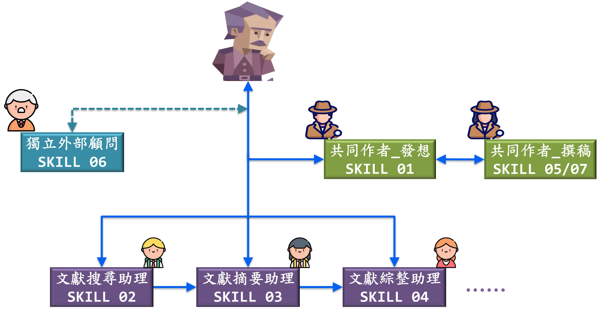

# academic-ai-workflow

> **English** ｜ [繁體中文](README_CHT.md)

**An institution-based AI collaboration workflow for academic research** — a three-layer architecture (a rules layer, a thinking layer, and an execution layer of seven pipelined skills) on a governed folder base, together turning a large language model into an auditable research assistant.

> 本專案主要文件為繁體中文。完整的設計原理與架構說明見[工作流架構白皮書](docs/工作流架構白皮書.md)，安裝與操作見[快速上手指南](docs/快速上手指南.md)。This README is the English overview; the full documentation is in Traditional Chinese.



> What I am really doing is handing my own judgment and domain knowledge to the AI, wholesale, training it into a version of me that never tires.
>
> The quality and integrity dilemmas of AI-assisted research are not a problem of technique but of governance. The answer lies not at the level of a single conversation (prompting), but in building the researcher's judgment into a machine-readable, executable, and auditable architecture (harnessing).
>
> What belongs in the automated execution layer and what must stay in your hands is a call only someone who does the research by hand, every day, can make.

## The problem

Generative AI is already inside research work. Used casually — one prompt, one output — it fabricates citations, attaches invented page numbers and claims to real papers, overstates causal language beyond what the research design supports, and degrades over long sessions. The common responses are prohibition or reliance on prompting skill. This project takes a third route, borrowed from public administration: treat the AI as a highly capable but imperfectly reliable agent, and govern it the way organizations govern agents — with **division of labor, delegation rules, audit trails, and version control**. Quality comes from reliable processes, not reliable individuals; that principle holds for AI too.

## Architecture: three layers on a governance base

The layering answers not "where do files live" but "what do the human and the AI externalize to each other": the **rules layer** is written *for the AI* (who you are, how to collaborate with you), the **thinking layer** is written *for yourself* (what this paper actually argues — the AI merely reads it), and the **execution layer** is where human and AI work together (seven pipelined skills). Beneath all three sits a **governance base**: folder read/write rules that decide where outputs land and who may write.

1. **Rules layer — judgment, externalized** (`starter-kit/00_專案控制/`) — four templates that turn the researcher's judgment into machine-readable institutions: `about-me.md` (goals, time budget, task-priority rules — plus a **self-declared writing-habit registry**: you list your known bad habits, e.g. "my literature reviews expand without limit," and every skill actively intercepts them), `research-identity.md` (research positioning and a five-tier map of your theoretical fluency, so the AI calibrates depth instead of lecturing you on basics), `writing-standards.md` (argumentation rules, a ban-list of AI writing tics, citation-honesty rules, and a quality bar below which the AI must flag rather than deliver), and `portfolio-status.md` (a dashboard for time-sensitive project state). One principle governs all four: write them in your own words — they are a letter to your AI, not a form to fill in.

2. **Thinking layer — your thinking, made explicit** (`00_專案控制/paper-structure.md`) — the hub of the whole pipeline, and deliberately *not* a spec file for the AI: your research question (a question, not a topic), your core proposition, your argument path, your chosen supports, and — the most important field — the stuck points you have not yet worked out, honestly flagged. It is drafted with skill 1 and every downstream stage anchors to what *you* wrote; where you have not finished thinking, the institution demands an honest marker, not an AI stand-in.

3. **Execution layer — seven pipelined skills** (`skills/1-*` … `7-*` hold the source folders; `skills/packaged/` holds the same skills packaged as installable `.skill` files) — each with a defined input contract, output format, and quality gates:

   | # | Skill | Stage |
   |---|-------|-------|
   | 1 | research-design-diagnosis | Paper structure (chapter → section → subsection), with a commitment gate: you state your answer before the AI offers one |
   | 2 | literature-search | API-grounded candidate pools (OpenAlex / Semantic Scholar); every DOI script-verified; no candidates from model memory |
   | 3 | literature-analysis | Per-paper deep analysis; knowledge file (paper-agnostic, reusable) separated from application file (bound to your manuscript) |
   | 4 | literature-synthesis | Cross-paper theory mapping where **every claim has an owner** — source-attributed, no orphan statements |
   | 5 | chapter-drafting | Paragraph-by-paragraph drafting with a strict citation whitelist and claim-level auditing (even uncited assertions are checked) |
   | 6 | review-diagnosis | Reviewer/self-review QA with pre-committed scoring plans and a concession threshold (the AI backs down only for factual errors, in-text evidence, or stronger counter-arguments — never because the author insists) |
   | 7 | thematic-analysis | Parallel branch for primary data (interview transcripts, field notes): qualitative analysis with quote-provenance audits (file + line-number anchors, re-read and verified before delivery) |

   Skills 1–5 form the linear pipeline (design → search → analysis → synthesis → drafting); skill 6 is a cross-cutting QA stage that reviews any of their outputs; skill 7 is a parallel branch that feeds thematic results directly into drafting.

**Governance base — folder read/write rules** (`starter-kit/`) — six folders map to research stages: `00_專案控制/` (control files), `01_文獻/` (literature), `02_資料與證據/` (data & evidence), `03_寫作/` (manuscripts), `04_審稿與回應/` (reviews & responses), `05_輸出/` (outputs). Folders `00`–`04` are read-only during task execution; `05_輸出/` is the AI's **only** writable area. Every output lands there first and is promoted to the formal folders only by the human. Authority separation is enforced by the file system, not by promises.

## The core mechanism: a fabrication-proofing chain

Hallucinations propagate downstream: one fabricated claim absorbed at the analysis stage gets written into the synthesis map, then cited in the manuscript, gaining legitimacy at every step. So anti-fabrication here is not a feature of one skill but **six lines of defense along the whole pipeline**:

1. API-grounded search with script-level DOI verification at the entrance — fabricated papers never enter the pool;
2. a "source-material-first" clause, enforced at analysis, synthesis, and drafting: specific claims (figures, page numbers, quotes, positions) may come only from the actually-loaded PDFs — model memory may suggest search directions, never assert content;
3. inference audits at the analysis stage, separating "what the paper says" from "what the AI infers";
4. owner-attributed synthesis — every claim in the theory map carries its source — with explicit coverage-gap reporting;
5. claim-level auditing at drafting: even uncited assertions are classified and checked, and causal claims are tested against the inferential strength the research design can support;
6. quote-provenance audits for qualitative data — every coded excerpt anchored to file and line number, re-read against the original transcript before delivery.

The shared philosophy: never trust a single point, never trust memory, never let the generator verify itself.

## Getting started

```
git clone https://github.com/LoWeiLee/academic-ai-workflow.git
```

1. Copy `starter-kit/` as your research workspace and fill in the four control files (templates include field-by-field guidance and fictional examples).
2. Install the seven skills from `skills/packaged/` (or start with skills 2 + 3 only).
3. Run a small real topic through search → analysis to feel the handoff rhythm, then scale up.

Step-by-step instructions (Traditional Chinese): [docs/快速上手指南.md](docs/快速上手指南.md).

## Honest limits

This workflow raises execution quality; it cannot solve ill-defined requests or make taste judgments for you, and it says so explicitly. The search process is transparent and logged but is **not** a systematic-review tool and must not be claimed as one in publications. The fabrication defenses reduce risk substantially but do not transfer the author's final responsibility for every citation. Your paper remains your paper.

## Genealogy and license

Skills 1–6 and all documents are the author's original work, built and iterated in real research projects before any external suite was consulted. The open-source suite [Imbad0202/academic-research-skills](https://github.com/Imbad0202/academic-research-skills) was later used as an external reference system: its mechanism ideas were systematically compared against skills 1–6 and selectively adopted for calibration, but its content was never copied into them. Skill 7 (thematic-analysis) is the single exception — it was adapted from that suite and is therefore released under **CC BY-NC 4.0** with attribution. Skills 1–6 and all documents are **CC BY 4.0**; code under `scripts/` is **MIT**. See [LICENSE.md](LICENSE.md).

## Author

Lo-Wei Lee (李洛維), Assistant Professor, Taiwan Police College.

**Citation**: Lee, L.-W. (2026). *academic-ai-workflow: An institution-based AI collaboration workflow for academic research* (v1.0.0). https://github.com/LoWeiLee/academic-ai-workflow
